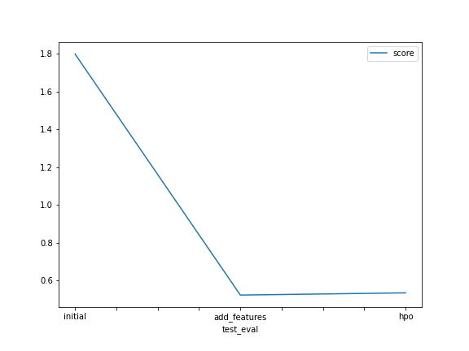

# Report: Predict Bike Sharing Demand with AutoGluon Solution
#### EMMANUEL MAYOWA SAMUEL

## Initial Training
### What did you realize when you tried to submit your predictions? What changes were needed to the output of the predictor to submit your results?
TODO: I realized predictions shouldn't be negative, they can either be equal to zero or greater than. There will be an error in submission if there is any negative value in the predictions. So i dropped any negative predictions and also applied clipping to the have low boundary of zero. 

### What was the top ranked model that performed?
TODO: The WeightedEnsemble_L3

## Exploratory data analysis and feature creation
### What did the exploratory analysis find and how did you add additional features?
TODO: It was observed that people rented pikes less from Day 8 - Day 10 of a month, but rent more pikes from Jan to mid March 2011 and from Oct to
mid January 2012. Also rent more during the following hours (0:00 -2:30 am, 7:00 -9:00 am,
1:00 -3:00 pm, 8:30 -11:00 pm).I added features like weather by categorizing it so the models know they are not just numbers.
The correlation between Season and month was equal to 1 and above, therefore the season
column was dropped from the train and test datasets.

### How much better did your model preform after adding additional features and why do you think that is?
TODO: Add your explanation
My score of 1.79368, improved to 0.52424.
This was because additional features were added which made the model to have a better understanding of the datetime column
not as just numbers. Where new features of hour, month and day were used and datetime column was dropped.

## Hyper parameter tuning
### How much better did your model preform after trying different hyper parameters?
TODO:  It was slightly decreased from 0.52424 to 0.53600

### If you were given more time with this dataset, where do you think you would spend more time?
TODO: More time on feature engineering with exploratory data analysis

### Create a table with the models you ran, the hyperparameters modified, and the kaggle score.
|model|hpo1|hpo2|hpo3|score|
|--|--|--|--|--|
|initial|default|default|default|1.79368|
|add_features|default|default|default|0.52424|
|hpo|'GBM':{ 'num_boost_round': 100, 'num_leaves': ag.space.I... | 'RF':{'n_estimators':200,'criterion':['gini','entropy','... | 'KNN':{'n_neighbors':4,'weights':'distance','algorithm'... | 0.53600

### Create a line plot showing the top model score for the three (or more) training runs during the project.

TODO: Replace the image below with your own.

### Create a line plot showing the top kaggle score for the three (or more) prediction submissions during the project.

TODO: Replace the image below with your own.

## Summary
TODO: Problem: Better utilization of the data generated by the systems in the bike sharing
industry as well as exogenous information are keys to take business advantages for
firms.
Business Objective: Predict bike sharing demand provided data related to different
factors provided.
Obtain Data Data is obtained from the "Bike Sharing Demand" kaggle competition.
Analyze Data Data is described, visualized and modified mainly using Pandas,
Matplotlib and Seabon library.
Build Model Built models using Autogluon AutomML library. Initially created model
without any preprocessing. Later, built models creating new features and tuning
hyper parameters.
Test Model Models are tested by submitting the predictions to Kaggle and
compared the models based on the score obtained.
